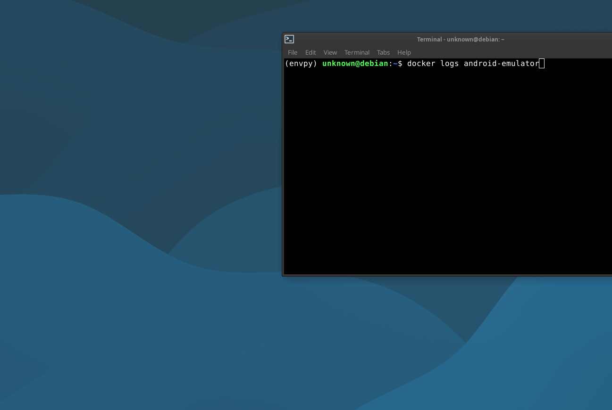

<br /><br /><br />
<p align="center">
  
</p><br /><br />

[](LICENSE)
[](https://hub.docker.com/)

# docker-android
> All-in-one Android analysis lab in Docker: Android Emulator-as-a-Service bundled with Frida, QBDI, and Magisk for rooted dynamic analysis, tracing, and instrumentation.  AGPL-3.0 license 


A reproducible **Android dynamic analysis lab** running a **headless Android Emulator-as-a-Service** inside Docker, orchestrated by **Supervisor** and pre-bundled with:

- **Magisk (v30.6)** for rooted workflows
- **Frida (v17.2.16)** for runtime instrumentation & hooking
- **QBDI (v0.12.0)** for binary instrumentation / tracing

This setup is designed for **rooted dynamic analysis, tracing, and instrumentation** with **ADB access exposed to the host**, plus optional UI access via **scrcpy**.



---

## 📚 Documentation

Please refer to the detailed documentation sections below:

- [docker-android](#docker-android)
  - [Features](#features)
  - [Architecture](#architecture)
  - [Ports](#ports)
  - [Default toolchain versions](#default-toolchain-versions)
  - [Requirements](#requirements)
  - [Quick start](#quick-start)
    - [Plain Docker](#plain-docker)
  - [Usage](#usage)
    - [Connect with ADB](#connect-with-adb)
    - [UI access with scrcpy](#ui-access-with-scrcpy)
    - [Frida](#frida)
  - [Persistence](#persistence)
  - [Troubleshooting](#troubleshooting)
    - [Logs](#logs) 
  - [License](#license)

---

## Features

> What you get with docker-android

* **Headless Android Emulator:** Runs API 34 (Android 14), Google APIs, x86_64 architecture inside a Docker container.
* **Service Orchestration:** **Supervisor** manages the emulator lifecycle:
    * Launches `run-emulator.sh`
    * Manages `socat` relays
    * Handles automated recoveries if the emulator crashes
* **Network Relays:** Uses `socat` to reliably expose emulator ports (which usually bind to container localhost) to your host machine.
* **Automated Frida Bridge:** Automatic port forwarding setup connecting the device's Frida server to a reliable TCP port on the host.
* **Stable Host Ports:** ADB, Console, and Frida ports are static, making tool integration easy.
* **Automation Ready:** Ideal for CI/CD pipelines, scripted installs, and repeatable snapshots.
* **Ready-to-script:** Mount your scripts/tools into the container.

---
## Architecture

This container uses a multi-process approach managed by **Supervisor**.

### Why `socat`?
The Android emulator typically binds ports to `127.0.0.1` *inside* the container context. This makes them inaccessible to the Docker network gateway. To make these accessible to your host machine without complex networking hacks, this image uses `socat` relays.

### Component Flow
1.  **Entrypoint:** Supervisor starts.
2.  **Emulator:** The Android emulator boots (`emulator-5558`).
3.  **Relays:** `socat` processes start, listening on external interfaces and piping traffic to the internal emulator localhost ports.
4.  **Bridges:** Scripts monitor the emulator state and set up `adb forward` rules for tools like Frida.

---

## Ports

> Ports (Host → Container)

| Purpose | Host Port | Container Port | Notes |
| :--- | :--- | :--- | :--- |
| **Emulator Console** | `5554` | `5554` | Relayed via `socat` to the emulator console port. |
| **ADB** | `5555` | `5555` | Relayed via `socat` to the emulator ADB port. |
| **Frida Server** | `37043` | `37043` | Bridged connection (Host → Container → Device). |

### Frida Forwarding Path
The connection flow for Frida is automated as follows:

1.  **Device:** `frida-server` runs on the Android device listening on a Unix socket or local TCP.
2.  **Internal:** The container runs `adb forward tcp:37042 tcp:27042`.
3.  **Bridge:** `socat` listens on container port `:37043` and bridges it to `127.0.0.1:37042`.
4.  **Host:** You connect your client to `127.0.0.1:37043`.

---

## Default Toolchain Versions

These versions are pre-installed in the image.

| Tool | Version | Notes |
| :--- | :--- | :--- |
| **Android API** | `34` | Android 14 (UpsideDownCake) |
| **Build Tools** | `34.0.0` | |
| **Emulator** | `nexus` | Generic AVD profile |
| **Frida** | `17.2.16` | `android-x86_64` |
| **Magisk** | `v30.6` | Source cloned to `/opt/magisk` |
| **QBDI** | `v0.12.0` | Installed in `/opt/qbdi` |

*Note: You can override many of these via environment variables in `docker-compose.yml`.*
---
# Requirements

To run this container effectively, you need:

1.  **Docker Engine** & **Docker Compose**
2.  **KVM (Kernel-based Virtual Machine)**
    * *Reason:* Hardware acceleration is strictly required for the Android Emulator to run at a usable speed.
    * **Linux:** Ensure `/dev/kvm` exists and your user has permissions (`sudo usermod -aG kvm $USER`).
    * **Windows:** Ensure Hyper-V/WSL2 backend is enabled in Docker Desktop.
    * **macOS:** Ensure virtualization is enabled.
---
## Usage

Connecting ADB
Once the container is running and the emulator has finished booting:

## Quick start

```bash
docker compose up -d --build
```

## Plain Docker


```bash
docker run -it --rm \
  --device /dev/kvm \
  -p 5554:5554 \
  -p 5555:5555 \
  -p 37043:37043 \
  ramonmartins886/docker-android:latest

```

## Connect with ADB:
> When it’s booted, connect from the host

```bash
adb connect 127.0.0.1:5555
adb devices
```


## UI access with scrcpy:

```bash
scrcpy -s 127.0.0.1:5555 -S
```

---

---

## Frida

With the container running and ADB connected:

### Verify Frida can see the device


```bash
frida-ps -H 127.0.0.1:37043
```
### Attach to a process (example)
```bash
frida -H 127.0.0.1:37043 -n com.example.app -l script.js
```

## Persistence

Volumes are already wired for common persistence paths (AVD config, emulator auth token, and the system image directory). Uncomment / adjust volume mappings if you want full /data persistence or SDK persistence across rebuilds. 

## Notes

KVM is required for decent performance and is passed through with /dev/kvm.

The emulator commonly binds to localhost inside the container; socat is used to expose ports to the host cleanly.

Supervisor ensures the emulator + port bridges restart automatically if they crash.

## Troubleshooting

### Emulator is slow / won’t boot
* **Check KVM:** Confirm KVM is working and `/dev/kvm` is mounted into the container.
* **Memory:** Ensure you have allocated enough RAM to Docker.

### ADB won’t connect
* **Check Ports:** Verify `-p 5555:5555` is set.
* **Check Services:** Look at supervisor logs to ensure `socat_adb` started.

### Frida can’t connect
Check the port chain in order:
1.  Is host port `37043` open?
2.  Is `socat_frida` running in the container?
3.  Is the `adb_frida` forward script running?
4.  Is `frida-server` running on the device?

### Port conflicts
Stop any local Android Emulators or other services using `5554`, `5555`, or `37043`.

### Viewing Logs
You can inspect Supervisor logs inside the container:
```bash
/var/log/emulator.*.log
/var/log/socat_*.log
/var/log/adb_frida.*.log
```

### Logs

```bash
docker exec -it android-emulator tail -n 200 /var/log/supervisord.log
docker exec -it android-emulator tail -n 200 /var/log/emulator.stderr.log
docker exec -it android-emulator tail -n 200 /var/log/emulator.stdout.log
docker exec -it android-emulator tail -n 200 /var/log/socat_*.stderr.log
docker exec -it android-emulator tail -n 200 /var/log/adb_frida.stderr.log
```
## License
> This project is licensed under the AGPL-3.0 License.


